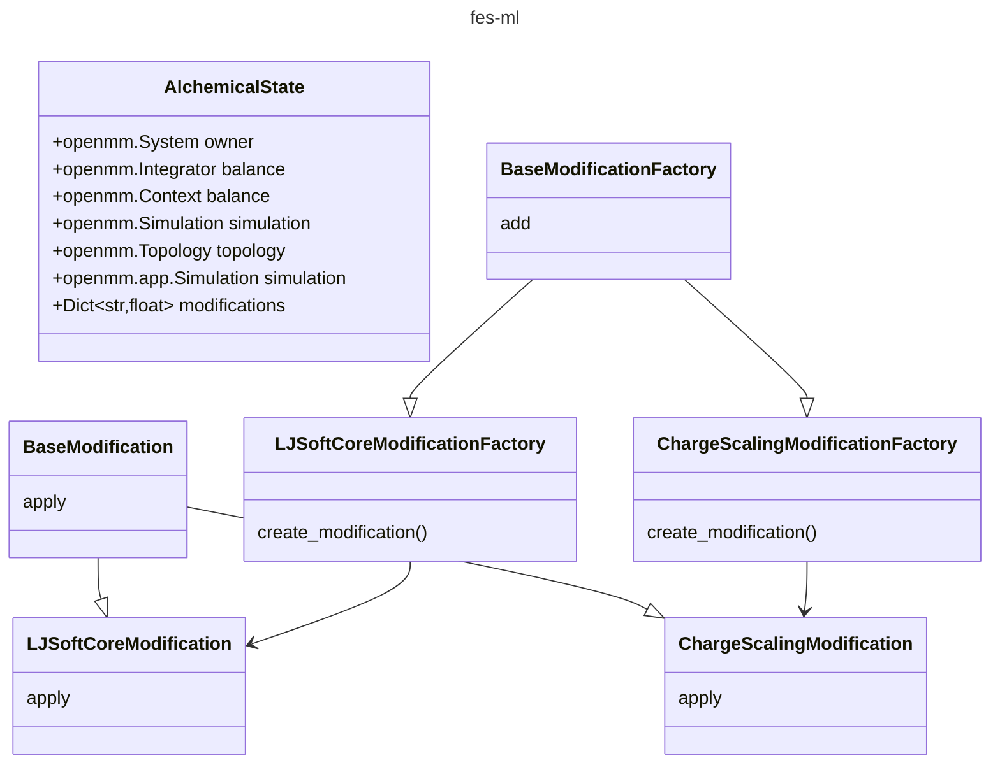

```mermaid
---
title: fes-ml
---
classDiagram
    class AlchemicalState
    AlchemicalState : +openmm.System owner
    AlchemicalState : +openmm.Integrator balance
    AlchemicalState : +openmm.Context balance
    AlchemicalState : +openmm.Simulation simulation
    AlchemicalState : +openmm.Topology topology
    AlchemicalState : +openmm.app.Simulation simulation
    AlchemicalState : +Dict~str,float~ modifications
    
    %% Abstract classes
    class BaseModification
    BaseModification : apply

    class BaseModificationFactory
    BaseModificationFactory : add

    %% Factories
    class ChargeScalingModificationFactory
    ChargeScalingModificationFactory : create_modification()

    class LJSoftCoreModificationFactory
    LJSoftCoreModificationFactory : create_modification()

    %% Modifications
    class LJSoftCoreModification
    LJSoftCoreModification : apply

    class ChargeScalingModification
    ChargeScalingModification : apply
    
    %% Relationships between classes

    %% Modification factories
    BaseModificationFactory --|> LJSoftCoreModificationFactory
    BaseModificationFactory --|> ChargeScalingModificationFactory
    
    %% Modification
    BaseModification --|> LJSoftCoreModification
    BaseModification --|> ChargeScalingModification

     %% Factory -> created object
    LJSoftCoreModificationFactory --> LJSoftCoreModification
    ChargeScalingModificationFactory --> ChargeScalingModification
```

