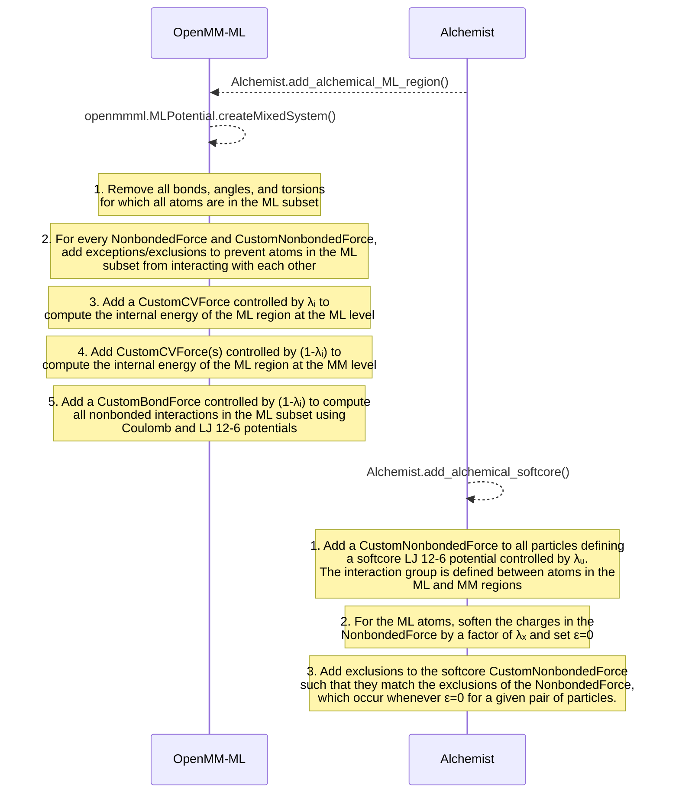

# fes-ml

A package to run hybrid ML/MM free energy simulations.

## Table of Contents


1. [Installation](#installation)
2. [Examples](#examples)
    1. [Alchemical Modification of Hybrid ML/MM Systems (OpenMM-ML)](#alchemical-modification-of-hybrid-mlmm-systems-openmm-ml)
    2. [Alchemical Modification of Hybrid ML/MM Systems (Sire-EMLE)](#alchemical-modification-of-hybrid-mlmm-systems-sire-emle)


## Installation

First, create a conda environment with all of the required dependencies:

```
conda env create -f environment.yaml
conda activate fes-ml
```

Finally, install `fes-ml` within the activated environment:

```bash
pip install -e .
```

## Examples

### Alchemical Modification of Hybrid ML/MM Systems - OpenMM-ML

The following alchemical transformations can be performed:

- Interpolating between the ML and MM potentials ($\lambda_i$).
- Turning on/off the van der Waals interaction between the ML and MM atoms using a softcore Lennard-Jones potential controlled by $\lambda_u$.
- Turning on/off the electrostatic interaction between the ML and MM atoms by scaling the ML charges by $\lambda_x$.

`Alchemist` is a factory of OpenMM systems that generates fixed-lambda systems suitable for perform FE simulations. For instance, to create a system with $\lambda_i=1.0$, $\lambda_u=0.5$, and $\lambda_x=0.2$, execute the following:


```python
alchemist = Alchemist(system, alchemical_atoms)
system = alchemist.alchemify(lambda_i=1.0, lambda_u=0.5, lambda_x=0.5, ml_potential="ani2x")
```

What the `alchemify` method is doing under the hood is depicted in the diagram below:




The energy of an alchemical system created in such a way reads:

```math
E(\vec{R}_{lig}, \vec{R}_{sol};\lambda_i,\lambda_u,\lambda_j)=  \lambda_i E_{lig}^{ML,vac}(\vec{R}_{lig}) + (1-\lambda_i )E_{lig}^{MM,vac}(\vec{R}_{lig}) \\ + \lambda_u E^{MM,vdw}_{lig-sol}(\vec{R}_{lig}, \vec{R}_{sol}) + \lambda_x E^{MM,Coulomb}_{lig-sol}(\vec{R}_{lig}, \vec{R}_{sol}) + E_{sol}^{MM}(\vec{R}_{sol})
```

### Alchemical Modification of Hybrid ML/MM Systems - EMLE-Sire
